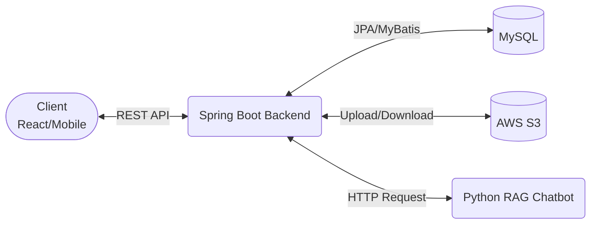
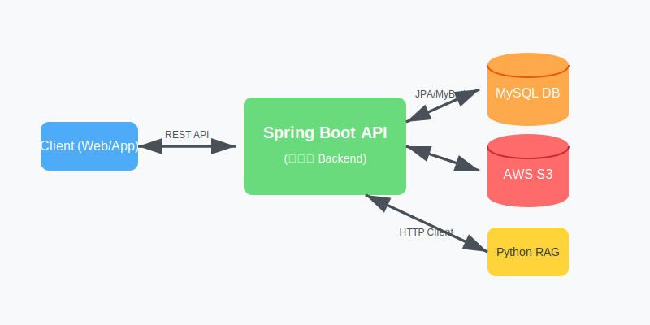

# 🚀 인계점 - Backend

본 프로젝트는 RAG 기반 챗봇을 이용한 인수인계 플랫폼, 인계점의 백엔드 리포지토리입니다.<br>
프론트엔드와 백엔드가 분리된 구조로, 본 리포지토리는 RESTful API 서버의 역할을 담당합니다.<br>(참고: 리포지토리 내의 일부 HTML/Thymeleaf 파일은 테스트용 어드민 페이지 등으로 사용됩니다.)

## 📅 Schedule / Milestones
> **TODO**: 실제 캡스톤 진행 일정에 맞춰 수정해주세요.
- **202X.0X - 202X.0X**: 기획 및 요구사항 정의
- **202X.0X - 202X.0X**: 시스템 아키텍처 및 데이터베이스(ERD), API 설계
- **202X.0X - 202X.0X**: 백엔드 핵심 API, 챗봇 연동 및 어드민 페이지 구현
- **202X.0X - 202X.0X**: 프론트엔드 연동 통합 테스트 및 QA
- **202X.0X**: 최종 배포 및 발표 준비

## 👥 Team & Roles
> **TODO**: 팀원들의 이름, GitHub 아이디, 역할로 채워주세요.
> 
| 👑 팀장 TODO_이름 | 💻 팀원 TODO_이름 | 💻 팀원 TODO_이름 |
|:---:|:---:|:---:|
|  |  |  |
| [@TODO_id](https://github.com/TODO_id) | [@TODO_id](https://github.com/TODO_id) | [@TODO_id](https://github.com/TODO_id) |
| **Backend & Infra**<br>- 시스템 아키텍처 설계<br>- AWS CI/CD 구축 | **Backend API**<br>- 결재 시스템 API 개발<br>- RAG 챗봇 연동 | **Frontend / QA**<br>- 어드민 페이지 개발<br>- 통합 테스트 |

## 🛠 Tech Stack

- **Language:** Java 17
- **Framework:** Spring Boot
- **Database / ORM:** MySQL, Spring Data JPA, MyBatis (복잡한 쿼리 처리용)
- **Security:** Spring Security, JWT (jjwt, auth0), AES256 (데이터 암호화)
- **Storage:** AWS S3 (파일 업로드/다운로드)
- **API Docs:** Swagger (Springdoc OpenAPI 2.3.0)
- **Others:** Spring Boot RestClient (외부 API 연동)

## 🏛️ System Architecture



## 🗄️ Database ERD
> **TODO**: 설계하신 프로젝트 ERD 이미지(예: erd.png)를 캡처하여 리포지토리에 올리고 아래에 링크를 삽입해주세요.
> 
> ``

## 📌 Key Features

1. **사용자 및 권한 관리 (User & Permission)**
   - Spring Security와 JWT를 활용한 인증/인가 체계 구축
   - 세밀한 권한(Permission, Permission Detail) 관리 및 부여 (User, Space, Group 단위)
2. **협업 공간 및 조직 관리 (Space & Group)**
   - 워크스페이스(Space) 생성 및 멤버 초대
   - 그룹(Group) 단위의 관리 및 조직도 구성
3. **전자 결재 시스템 (Approval)**
   - 결재 상신, 승인, 반려 등의 상태를 관리하는 워크플로우 (UserApproval)
   - 단계별 결재 상태(StepStatus) 추적
4. **업무 인수인계 (Handover)**
   - 담당자 변경 및 퇴사 시 업무 인수인계 내역 기록 및 조회 기능
5. **파일 및 폴더 관리 (File & Folder)**
   - AWS S3를 연동하여 안전한 파일 업로드, 다운로드, 관리
   - 폴더 구조를 모방한 논리적 계층 관리
6. **RAG 기반 챗봇 연동 (Chatbot)**
   - 내부 데이터를 활용할 수 있는 외부 RAG 챗봇 API와의 통신 기능 (`RagChatbotClient`)

## 🚀 Deployment
현재 프로젝트는 GitHub Actions와 Docker를 이용해 배포 파이프라인이 구성되어 있습니다.

- **CI/CD**: GitHub Actions (`.github/workflows/deploy.yml`)
- **Containerization**: Docker (`Dockerfile`)
- **Infra/Server**: AWS EC2 (Ubuntu 22.04 LTS, t3.micro)
- **Database**: EC2 내 로컬 MySQL
- **Web Server**: Nginx (Reverse Proxy)
- **Prod Server URL**: `https://ingyejeom.cloud`

## 📂 Project Structure

```text
src/main/java/com/thc/capstone
├── client/       # 외부 API(챗봇 등) 호출을 위한 클라이언트
├── config/       # Security, Swagger, S3, MyBatis 등 설정 클래스
├── controller/   # REST API 엔드포인트 (프론트 통신용)
├── domain/       # JPA Entity 클래스
├── dto/          # 계층 간 데이터 교환을 위한 DTO
├── exception/    # 커스텀 예외 처리
├── mapper/       # MyBatis Mapper 인터페이스
├── repository/   # Spring Data JPA 리포지토리
├── security/     # Spring Security 및 JWT 필터/Provider
├── service/      # 비즈니스 로직
└── util/         # 공통 유틸리티 (AES256 암호화, Token 생성 등)
```

## ⚙️ Getting Started (Local Development)

### Prerequisites
- JDK 17
- MySQL
- Gradle

### Environment Variables

프로젝트를 실행하기 위해 `src/main/resources/application.yml` (혹은 `.properties`) 파일에 다음 정보들이 필요합니다.
해당 파일은 보안상 리포지토리에 커밋되지 않으므로 팀원 간 별도 공유가 필요합니다.

```yaml
spring:
   application:
      # 프로젝트 애플리케이션 이름
      name: capstone

   # 1. 데이터베이스(MySQL) 설정
   datasource:
      url: jdbc:mysql://localhost:3306/your_database_name # DB 주소 및 스키마 이름
      username: your_db_username                         # DB 접속 계정명
      password: your_db_password                         # DB 접속 비밀번호
      driver-class-name: com.mysql.cj.jdbc.Driver

   # 2. JPA 및 하이버네이트 설정
   jpa:
      defer-datasource-initialization: true # Hibernate 초기화 후 data.sql 실행 보장
      hibernate:
         ddl-auto: update                    # 엔티티 변경사항을 DB 테이블에 자동 반영 (운영에서는 validate 권장)
      show-sql: true                        # 콘솔에 실행되는 SQL 쿼리 출력
      properties:
         hibernate:
            format_sql: true                  # 출력되는 SQL 쿼리를 가독성 좋게 정렬
            default_batch_fetch_size: 100     # N+1 문제 해결을 위한 Batch Size 설정 (IN 쿼리로 100개씩 묶어서 조회)
            jdbc:
               time_zone: Asia/Seoul           # DB 시간대를 한국 시간(KST)으로 설정

   # 3. 템플릿 엔진 캐시 설정 (개발 환경용)
   thymeleaf:
      cache: false                          # HTML 수정 시 서버 재시작 없이 즉시 반영되도록 캐시 끄기
   freemarker:
      cache: false

   # 4. 개발 편의성 설정 (DevTools)
   devtools:
      livereload:
         enabled: true                       # 정적 자원 수정 시 브라우저 자동 새로고침 허용
      restart:
         enabled: true                       # Java 클래스 수정 시 서버 자동 재시작 허용
      remote:
         restart:
            enabled: false                    # 원격 재시작 기능 비활성화 (보안)

   # 5. 초기 SQL 스크립트 실행 모드
   sql:
      init:
         mode: always                        # 서버 기동 시 schema.sql, data.sql 항상 실행

   # 6. CORS 및 업로드 설정
   web:
      cors:
         allowed-origins: http://localhost:3000 # 프론트엔드(React 등)의 접근을 허용할 도메인 주소
   servlet:
      multipart:
         max-file-size: 20MB                 # 첨부 파일 1개당 최대 허용 용량
         max-request-size: 20MB              # 1회 요청당 전체 멀티파트 데이터의 최대 용량

# Swagger(API 문서) 설정
springdoc:
   use-fqn: true                           # 클래스 이름 중복 충돌 방지를 위해 패키지명(FQN)을 포함하여 표시

# 7. 커스텀 외부 연동 설정 (JWT, 파일, 챗봇, AWS)
external:
   jwt:
      tokenSecretKey: your_jwt_secret_key_here       # JWT 암호화에 사용될 강력한 비밀키 (512bit 이상 권장)
      tokenPrefix: your_prefix                       # 토큰 헤더 접두사
      accessKey: Authorization                       # Access Token 헤더 명
      accessTokenExpirationTime: 1800000             # Access Token 만료 시간 (30분 = 1,800,000ms)
      refreshKey: RefreshToken                       # Refresh Token 헤더 명
      refreshTokenExpirationTime: 1209600000         # Refresh Token 만료 시간 (14일 = 1,209,600,000ms)

file:
   # 로컬 파일 저장 경로 (경로 끝에 '/' 필수, 윈도우 환경 주의)
   dir: C:/Users/user/Desktop/project/files/

chatbot:
   python:
      base-url: your_chatbot_base_url                  # 파이썬 RAG 서버 API 베이스 주소
      timeout-ms: 25000                                # 챗봇 API 요청 타임아웃 시간 (25초)
      default-space-id: default                        # 기본 스페이스 식별자

cloud:
   aws:
      s3:
         bucket: your_s3_bucket_name          # AWS S3 버킷 이름
      region:
         static: ap-northeast-2               # AWS 리전 (아시아 태평양 - 서울)
      stack:
         auto: false                          # EC2 환경이 아닐 때 불필요한 스택 자동 구성 방지 (로컬 구동 시 필수)
      credentials:
         access-key: your_aws_access_key      # AWS IAM 계정의 Access Key
         secret-key: your_aws_secret_key      # AWS IAM 계정의 Secret Key
```

### Build & Run
```bash
# 의존성 설치 및 빌드
./gradlew build -x test

# 로컬 서버 실행
./gradlew bootRun
```

## 📖 API Documentation

서버 실행 후, 아래 경로에서 Swagger UI를 통해 API 스펙을 확인하고 연동 테스트를 진행할 수 있습니다.
- Swagger UI: `http://localhost:8080/swagger-ui/index.html`
- Test Front-end : `http://localhost:8080/user/login`

## 🤝 Branch Strategy & Conventions

### 📌 브랜치 이름 규칙
`분류/기능-요약` 형식을 사용하며, **소문자와 하이픈(-)** 만 사용합니다. (Kebab Case)
* 예시: `feature/email-sender` (O) / `feature/emailSender` (X)

| 브랜치명 | 설명 |
|---|---|
| `main` | 배포 가능한 안정화 상태 (직접 Push 금지) |
| `develop` | 다음 버전을 위한 통합 개발 브랜치 |
| `feature/...` | 새로운 기능 개발 |
| `fix/...` | 버그 수정 |
| `refactor/...` | 기능 변화 없는 코드 구조 및 로직 개선 |

### 📌 커밋 메시지 규칙
`[Type] 제목` 형식을 사용하며, 제목은 50자 이내의 **명사형 종결**을 권장합니다.
* (선택) 상세 내용: 무엇을, 왜 변경했는지 본문에 추가 설명

| 태그(Type) | 의미 (Description) | 사용 예시 |
|---|---|---|
| `[feat]` | 새로운 기능 추가 | `[feat] 소셜 로그인 API 구현` |
| `[edit]` | 버그 또는 기존 기능 수정 | `[edit] 결제 금액 계산 오류 수정` |
| `[docs]` | 문서 작업 (README 등) | `[docs] API 명세서 업데이트` |
| `[style]` | 코드 포맷팅 (로직 변경 X) | `[style] 코드 들여쓰기 및 세미콜론 정리` |
| `[refactor]` | 코드 리팩토링 (기능 변경 X) | `[refactor] 중복되는 유틸 함수 통합` |
| `[test]` | 테스트 코드 추가/수정 | `[test] 회원가입 서비스 유닛 테스트 작성` |
| `[chore]` | 빌드, 패키지 매니저 등 | `[chore] .gitignore 파일 수정` |

---

## 🔄 협업 워크플로우 (The Loop)

**[1. 최신화] → [2. 브랜치 생성] → [3. 작업/저장] → [4. 업로드] → [5. PR 및 리뷰] → [6. 병합(완료)]**

### 1. 작업 시작 전 최신화 (Sync)
로컬의 `develop` 브랜치를 원격 저장소의 최신 상태로 동기화합니다.
```bash
git checkout develop
git pull origin develop
```
### 2. 작업 브랜치 생성 (Start)
develop에서 내가 작업할 전용 공간을 만듭니다.

```Bash
git checkout -b feature/작업명
```
### 3. 작업 및 커밋 (Coding)
규칙에 맞춰 코드를 작성하고 커밋합니다.

```Bash
git add .
git commit -m "[feat] 핵심 작업 내용 요약"
```

### 4. 깃허브로 업로드 (Push)
내 로컬 브랜치를 원격 저장소로 보냅니다.

```Bash
git push origin feature/작업명
```

### 5. PR 생성 및 리뷰 (Pull Request)
- GitHub 저장소에 접속하여 Compare & pull request 버튼을 클릭합니다.

- 🚨 주의: Base 브랜치가 main이 아닌 **develop**인지 반드시 확인합니다.

- 제목과 작업 내용을 작성하고, 리뷰어(Reviewers)를 지정한 뒤 PR을 생성합니다.

- 피드백을 받아 코드를 수정했다면 다시 git add → git commit → git push를 진행합니다. (기존 PR에 자동 반영됨)

### 6. 작업 종료 및 청소 (Clean up)
PR이 승인(Approve)되어 develop에 병합되면, 다음 작업을 위해 로컬 환경을 정리합니다.

```Bash
git checkout develop
git pull origin develop
git branch -d feature/작업명  # (선택) 다 쓴 브랜치 삭제
```